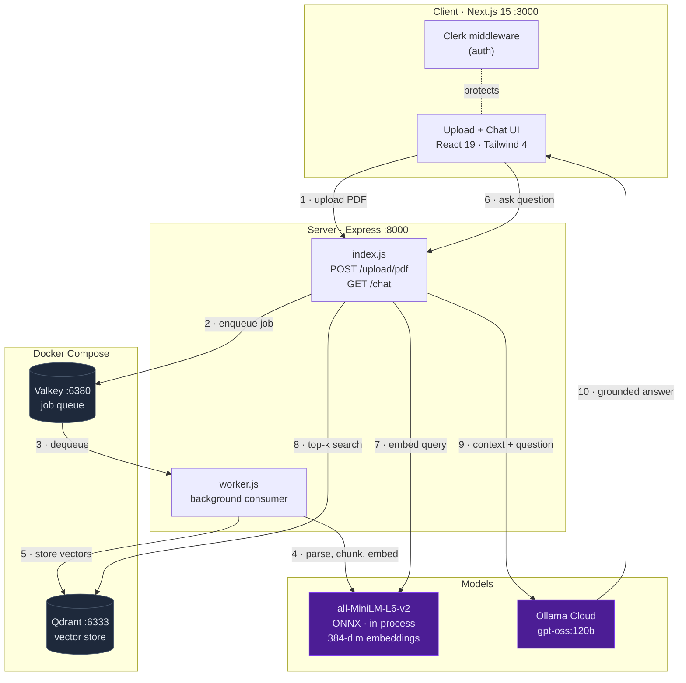
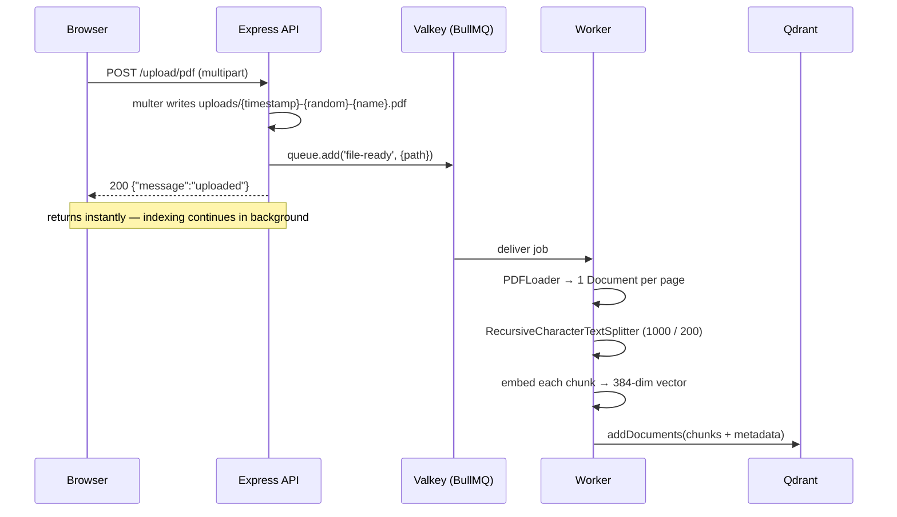
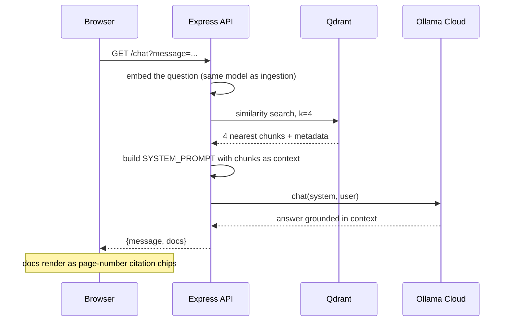

# PDF RAG

Upload a PDF, ask questions about it, get answers grounded in the document with page-level citations.

The system is a **Retrieval-Augmented Generation (RAG)** pipeline: instead of fine-tuning a model on your document, it stores the document as searchable vectors, retrieves only the passages relevant to each question, and hands those to an LLM as context. The LLM is instructed to answer *only* from that context, so it cites real pages instead of hallucinating.

Chat runs on **Ollama Cloud**. Embeddings run **locally in-process** via ONNX, so an Ollama API key is the only credential required.

---

## Architecture



### Why a queue sits in the middle

Parsing and embedding a PDF takes seconds to minutes. Doing that inside the HTTP request would block the connection and time out on large files. Instead `POST /upload/pdf` writes the file to disk, pushes a job, and returns `200` immediately. The worker is a **separate process** — it can crash, restart, or be scaled to N instances without touching the API.

---

## Request flows

### Ingestion (asynchronous)



### Query (synchronous)



---

## Tech stack

| Layer | Choice | Role |
|---|---|---|
| Frontend | Next.js 15 (App Router), React 19 | UI, server components |
| Styling | Tailwind CSS 4, shadcn-style primitives | Design system |
| Auth | Clerk | Sign-in on the frontend |
| API | Express 4 | Upload + chat endpoints |
| Uploads | Multer | Multipart → disk |
| Queue | BullMQ on Valkey | Decouples ingestion from the request |
| Orchestration | LangChain.js | Loaders, splitters, embeddings, vector-store adapters |
| PDF parsing | `pdf-parse` via `PDFLoader` | PDF → text, one Document per page |
| Vector DB | Qdrant | Stores vectors, does similarity search |
| Embeddings | `Xenova/all-MiniLM-L6-v2` (ONNX, in-process) | Text → 384-dim vector |
| LLM | Ollama Cloud, `gpt-oss:120b` | Generates the grounded answer |

---

## Prerequisites

- **Node.js 20.6+** (uses the built-in `--env-file` flag; developed on v24)
- **pnpm**
- **Docker** (for Valkey + Qdrant)
- An **Ollama Cloud API key** — <https://ollama.com/settings/keys>

---

## Setup

```bash
pnpm setup                    # installs root, server and client deps
cp server/.env.example server/.env   # add your OLLAMA_API_KEY
pnpm dev                      # starts everything
```

`pnpm dev` brings up all four services in one terminal: it waits for Valkey and Qdrant to report **healthy**, then runs the API, the worker, and the client in parallel with colour-coded log prefixes.

```text
[server] Server started on PORT:8000
[worker] Split 19 pages into 43 chunks
[client] ▲ Next.js 15.3.0 (Turbopack)  -  Local: http://localhost:3000
```

`Ctrl-C` stops all three Node processes; the containers keep running (`pnpm stop` to halt them).

### Scripts

| Command | Does |
|---|---|
| `pnpm setup` | Install dependencies in root, `server/`, and `client/` |
| `pnpm dev` | **Everything** — infra (waits for healthy) + server + worker + client |
| `pnpm infra` | Just the containers |
| `pnpm stop` | Stop containers, **keep** indexed vectors |
| `pnpm reset` | Stop containers and **delete** the Qdrant volume |

### Running services individually

Useful when you want to restart one piece without the others:

```bash
docker compose up -d --wait   # valkey :6380, qdrant :6333
cd server && pnpm dev         # API on :8000
cd server && pnpm dev:worker  # worker (separate terminal)
cd client && pnpm dev         # UI on :3000
```

Both server processes are required. Without the worker, uploads are accepted but never indexed.

> On the first question after a restart, the embedding model (~25 MB) downloads and initialises. That request is slow once, then fast — the UI shows a staged loader that explains the wait.

---

## Configuration

All server config lives in [`server/config.js`](server/config.js) and is env-overridable. See [`server/.env.example`](server/.env.example).

| Variable | Default | Notes |
|---|---|---|
| `OLLAMA_API_KEY` | *(required)* | Ollama Cloud key |
| `OLLAMA_MODEL` | `gpt-oss:120b` | Any model from the [cloud list](https://ollama.com/search?c=cloud) |
| `OLLAMA_HOST` | `https://ollama.com` | Point at a self-hosted Ollama if desired |
| `EMBEDDING_PROVIDER` | `local` | `local` \| `openai` \| `ollama` |
| `EMBEDDING_MODEL` | per provider | Overrides the provider default |
| `OPENAI_API_KEY` | — | Only when provider is `openai` |
| `CHUNK_SIZE` | `1000` | Characters per chunk |
| `CHUNK_OVERLAP` | `200` | Character overlap between chunks |
| `QDRANT_URL` | `http://localhost:6333` | |
| `QDRANT_COLLECTION` | per provider | Defaults keep providers from colliding |
| `VALKEY_HOST` / `VALKEY_PORT` | `localhost` / `6380` | Named `VALKEY_*`, not `REDIS_*`, so a machine-wide `REDIS_HOST` cannot hijack the queue |

### Embedding providers

Ollama Cloud hosts **chat models only** — no embedding model carries a `-cloud` tag, and the [cloud + embedding filter](https://ollama.com/search?c=cloud&c=embedding) returns nothing. So embeddings need their own provider:

| Provider | Model | Dims | Needs |
|---|---|---|---|
| `local` *(default)* | `Xenova/all-MiniLM-L6-v2` | 384 | nothing — runs in-process |
| `openai` | `text-embedding-3-small` | 1536 | `OPENAI_API_KEY` |
| `ollama` | `nomic-embed-text` | 768 | a self-hosted Ollama |

Each provider writes to its **own Qdrant collection**, because a collection's vector width is fixed at creation and the three widths differ. Switching providers means re-uploading your PDFs.

---

## Project structure

```text
pdf-rag/
├── package.json              # root: pnpm dev runs all four services
├── docker-compose.yaml       # valkey + qdrant
├── server/
│   ├── config.js             # single source of truth for providers & tuning
│   ├── index.js              # Express: POST /upload/pdf, GET /chat
│   ├── worker.js             # BullMQ consumer: parse → chunk → embed → store
│   └── uploads/              # multer destination
└── client/
    ├── middleware.ts         # Clerk
    └── app/
        ├── layout.tsx
        ├── page.tsx
        └── components/
            ├── file-upload.tsx
            └── chat.tsx      # staged loader, citation chips
```

---

## API

### `POST /upload/pdf`

Multipart, field name `pdf`. Returns immediately; indexing happens in the background.

```bash
curl -X POST -F "pdf=@document.pdf" http://localhost:8000/upload/pdf
# {"message":"uploaded"}
```

### `GET /chat?message=...`

```bash
curl "http://localhost:8000/chat?message=what%20is%20this%20about"
```

```jsonc
{
  "message": "The document is a study sheet for…",
  "docs": [
    {
      "pageContent": "…",
      "metadata": { "source": "uploads/…pdf", "loc": { "pageNumber": 6 } }
    }
  ]
}
```

`docs` drives the citation chips in the UI.

---

## Known limitations

Honest list — each is a deliberate scope cut, not an oversight.

- **The API is unauthenticated.** Clerk guards the Next.js frontend, but Express runs open `cors()` with no token check. Anyone who can reach `:8000` can upload and query.
- **All documents share one collection.** There is no per-user or per-document namespace, so every user queries every uploaded PDF.
- **No delete or re-index.** Removing a document means dropping the Qdrant collection manually.
- **Answers are not streamed.** The full response is awaited, so long answers feel slow. `ollama.chat({stream: true})` plus SSE would fix it.
- **`k` is hardcoded to 4** ([`index.js`](server/index.js)) with no re-ranking or score threshold.
- **Worker `concurrency: 100`** is meaningless for in-process ONNX embedding, which is CPU-bound — it would matter only for a network-backed provider.
- **Scanned/image PDFs yield nothing.** `pdf-parse` extracts embedded text only; there is no OCR.
- **`next lint` is broken** — `eslint.config.mjs` imports `eslint-config-next/core-web-vitals` without the required `.js` extension.

---

## Further reading

An interview-oriented deep dive on every technology choice, the alternatives considered, and the terminology lives in **[INTERVIEW.md](INTERVIEW.md)**.
